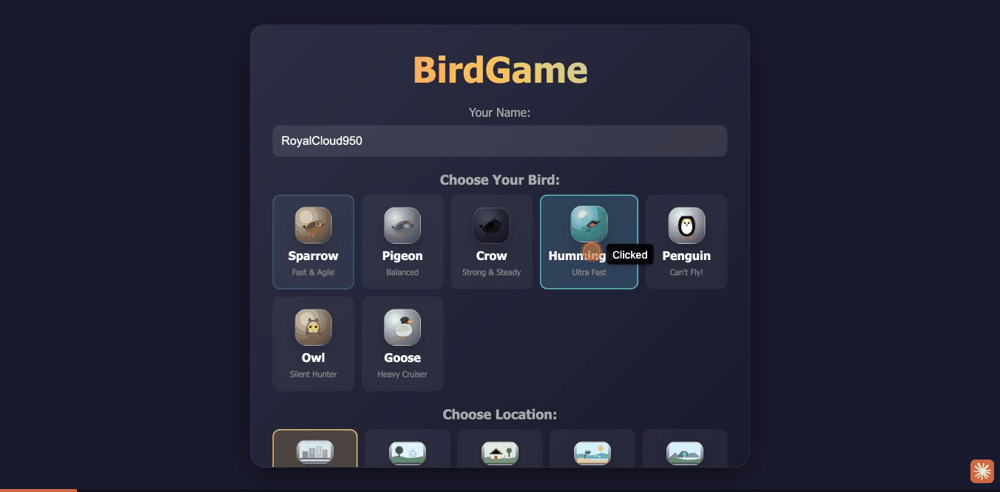

# BirdGame

A 3D multiplayer bird flying game built with Three.js. Fly as one of 7 bird types, collect worms and flies, compete on the leaderboard, and explore 5 unique locations.

**[Play the Demo](https://lifeart.github.io/birdgame/)**



## Features

- **7 bird types** — Sparrow, Pigeon, Crow, Hummingbird, Penguin, Owl, Goose — each with unique flight characteristics and glide mechanics
- **5 locations** — City, Park, Village, Beach, Mountain
- **Multiplayer** — WebSocket server or P2P via WebRTC (PeerJS)
- **Offline demo mode** — works without a backend (auto-fallback)
- **Collectibles** — worms (1pt), flies (4pt), golden worms (10pt)
- **Combo system** — collect items in quick succession for XP multipliers (1.5x/2x/3x)
- **Progression** — 50 levels, XP system, daily rewards, unlockable trails and auras
- **Weather & time of day** — dynamic weather with wind-blown rain
- **Visual effects** — collection bursts, golden worm glow, fly wing shimmer, bird scale pulse
- **PWA** — installable, works offline via service worker
- **Mobile** — touch controls with D-pad

## Quick Start

```bash
npm install
npm run build
npm start
```

Open `http://localhost:5000`

## Multiplayer Modes

**WebSocket (server):** Click "Start Game" — connects to the game server.

**P2P (no server needed):** One player clicks "Create Room" and shares the 6-character code. Others enter the code and click "Join Room". Uses WebRTC via PeerJS — the host manages game state.

**Demo (offline):** If no server is available, the game automatically falls back to single-player demo mode.

## Tech Stack

- **Frontend:** TypeScript, Three.js, esbuild
- **Backend:** Node.js, Express, WebSocket (ws)
- **P2P:** PeerJS (WebRTC)
- **Testing:** Vitest (unit), Playwright (e2e)

## Scripts

| Command | Description |
|---------|-------------|
| `npm start` | Start dev server |
| `npm run build` | Dev build |
| `npm run build:prod` | Production build (minified) |
| `npm test` | Run unit tests |
| `npm run test:e2e` | Run e2e tests |
| `npm run typecheck` | TypeScript check |

## License

MIT
